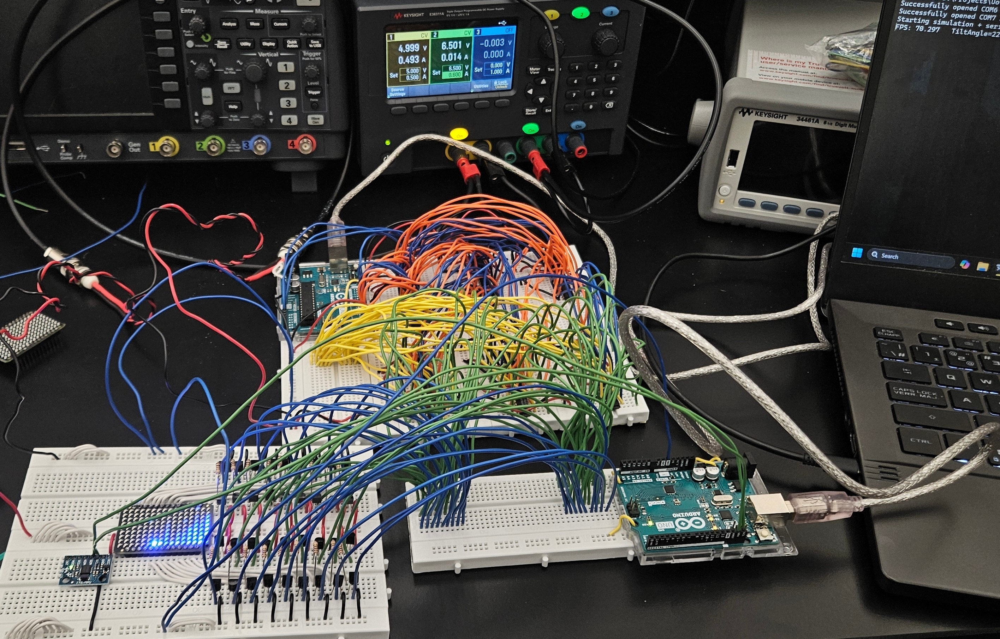
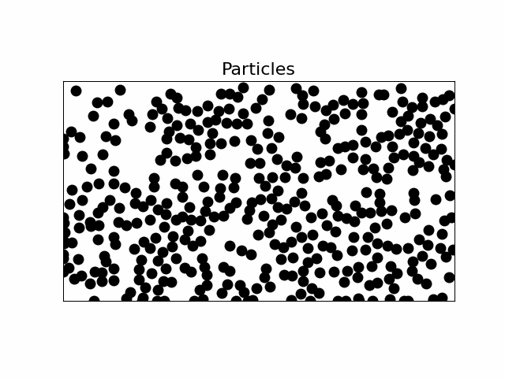
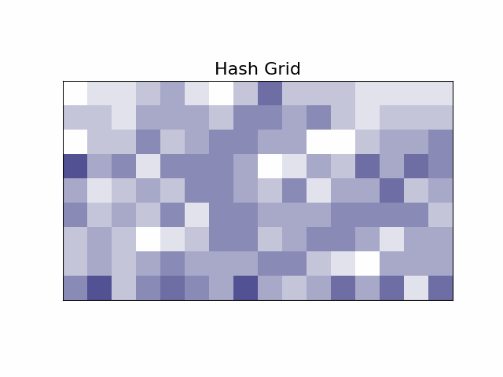

# 🌊 **Project Luminous FLow**
***Real-time fluid simulation on a LED matrix display*** responding to ***live accelerometer data***, rendered at 60+ FPS by a ***custom GPU built from scratch*** with Arduino and logic IC chips — continuum mechanics in a purely digital circuit!

  
  

## Physics Engine
The physics engine of our fluid simulation implements [Smoothed-particle hydrodynamics (SPH)](https://en.wikipedia.org/wiki/Smoothed-particle_hydrodynamics) proposed by Gingold and Monaghan in 1977 [[1]](#1). This can be found in [SPHEngine.cpp](SPHEngine.cpp), which in every cycle takes as input a 2D instaneously global acceleration in polar coordinates and outputs to update the positions of particles in the simulation.

💡 If you want to use our physics engine for your own project, we've included an isolated version of it in [Prototyping/SPHEnginePybind.cpp](Prototyping/SPHEnginePybind.cpp) that you can interact with through a Jupyter notebook such as [Prototyping/physics_testbench.ipynb](Prototyping/physics_testbench.ipynb), thanks to the [pybind11](https://github.com/pybind/pybind11) project. A Python implementation that we used in the early stages of this project is also available in [Prototyping/physics_testbench_py.ipynb](Prototyping/physics_testbench_py.ipynb).

⚠️ Please note that this physics engine is designed to be compiled and ran on a PC instead of a microcontroller.

  
  

___

<a id="1">[[1]](https://academic.oup.com/mnras/article/181/3/375/988212)</a> 
Gingold, R. A., & Monaghan, J. J. (1977). *Smoothed particle hydrodynamics: theory and application to non-spherical stars.* Monthly notices of the royal astronomical society, 181(3), 375-389.

Created by 
[@a663E-36z1120](https://www.github.com/a663E-36z1120)
&
[@AlexZengXi](https://www.github.com/AlexZengXi); shoutout to [Prof. Ziqing Hong](https://zqhong.physics.utoronto.ca/) from the Department of Physics at University of Toronto for teaching the amazing [PHY405H1: Electronics Lab](https://artsci.calendar.utoronto.ca/course/phy405h1) course and supporting this project!